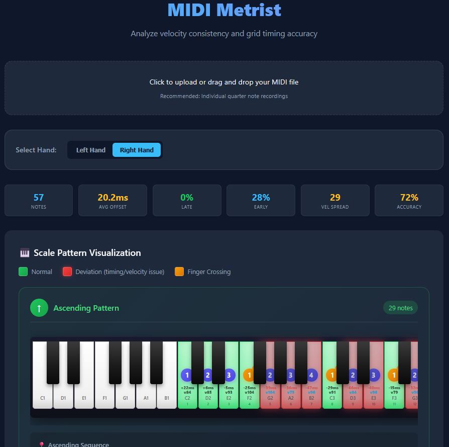

# MIDI Metrist

A specialized tool for analyzing rhythmic and dynamic evenness in piano scales. It is specifically designed to evaluate MIDI recordings of single-note patterns (such as quarter-note scales) played against a steady beat.

Unlike general MIDI timing tools, this analyzer focuses on the micro-consistency of technical execution, helping pianists identify finger-specific weaknesses and directional biases.

You can use the tool directly in your browser without any installation:
**[https://guillehoardings.github.io/midi-metrist/](https://guillehoardings.github.io/midi-metrist/)**

## 🎹 Key Features

### 1. Performance Dashboard
- **Notes Count**: Total notes analyzed.
- **Avg Offset**: Average absolute timing error in milliseconds.
- **Late/Early %**: Percentage of notes played significantly behind or ahead of the beat (>30ms).
- **Velocity Spread**: Range between loudest and softest notes (lower = more even touch).
- **Professional Accuracy**: Overall consistency score based on timing and dynamic precision.

### 2. Interactive Piano Visualization
- **Scale Mapping**: Visualizes your performance on a virtual 88-key piano.
- **Directional Analysis**: Separate visualizations for ascending and descending scale patterns.
- **Crossing Detection**: Automatically identifies finger crossings (thumb-under/finger-over) and highlights them with motion indicators.

### 3. Finger-Note Distribution Analysis
- **Pitch-Specific Data**: Distinguishes between octaves (e.g., C4 vs C5) to isolate range-specific technical weaknesses.
- **Directional Split**: Separate charts for ascending and descending movements to catch directional bias.
- **Micro-Timing**: Detailed breakdown of Avg Late (+) and Avg Early (-) offsets.

## 🛠️ Technical Stack

- **Core**: Vanilla JavaScript (HTML5/CSS3)
- **MIDI Parsing**: [@tonejs/midi](https://github.com/Tonejs/Midi)
- **Visualization**: [Chart.js](https://www.chartjs.org/)
- **Styling**: Premium CSS with Glassmorphism and CSS Grid/Flexbox

---
*Created for musicians looking to perfect their technical precision through data-driven practice.*
